## 开源不易，请各位朋友点个 ***★star★*** 支持一下，非常感谢~

[【 Github地址：https://github.com/Mrkuhuo/data-warehouse-learning 】](https://github.com/Mrkuhuo/data-warehouse-learning)

[【 Gitee 地址：https://gitee.com/wzylzjtn/data-warehouse-learning 】](https://gitee.com/wzylzjtn/data-warehouse-learning)

[【 博客 地址：http://bigdatacircle.top:8090/ 】](http://bigdatacircle.top:8090/)


## 1 介绍

《实时/离线数仓实战》代码，是以电商系统为底座，以电商各类指标统计需求为导向，开发基于Doris和Piamon、Hudi、Iceberg的离线数仓和实时数仓（数据湖）。离线和实时场景其数据处理逻辑是一致的，只是实现技术不一样，旨在给各位朋友提供一种数仓建设的不同思路参考。代码中有两个版本， **warehouseV1** 和 **warehouseV2** 的区别是V1业务逻辑较为简单，V2业务逻辑比较齐全，V1的模拟数据生产是通过 **Python** 脚本模拟生成，V2的模拟数据是通过 **JAVA** 代码来生成。

## 2 代码结构

```shell
├─src
│  └─main
│      └─java
│          └─org
│              └─bigdatatechcir
│                  ├─images
│                  ├─warehousev1
│                  │  ├─datageneration
│                  │  ├─doris
│                  │  │  ├─dml
│                  │  │  │  ├─ads
│                  │  │  │  ├─dwdarehouse-learning
│                  │  │  │  ├─dws
│                  │  │  │  └─ods
│                  │  │  └─logical
│                  │  │      ├─ads
│                  │  │      ├─dwd
│                  │  │      └─dws
│                  │  ├─flink
│                  │  │  ├─ads
│                  │  │  │  └─test
│                  │  │  ├─dwd
│                  │  │  │  └─test
│                  │  │  ├─dws
│                  │  │  │  └─test
│                  │  │  ├─ods
│                  │  │  │  └─test
│                  │  │  └─sql
│                  │  │      ├─ads
│                  │  │      ├─dwd
│                  │  │      ├─dws
│                  │  │      └─ods
│                  │  ├─mysql
│                  │  └─seatunnel
│                  └─warehousev2
│                      ├─datageneration
│                      │  ├─business
│                      │  └─userlog
│                      ├─doris
│                      │  ├─dml
│                      │  │  ├─ads
│                      │  │  ├─dim
│                      │  │  │  └─data
│                      │  │  ├─dwd
│                      │  │  ├─dws
│                      │  │  └─ods
│                      │  └─logical
│                      │      ├─ads
│                      │      ├─dim
│                      │      ├─dwd
│                      │      └─dws
│                      ├─flink
│                      │  ├─doris
│                      │  │  ├─catalog
│                      │  │  └─ods
│                      │  ├─hudi
│                      │  │  ├─ads
│                      │  │  ├─dim
│                      │  │  ├─dwd
│                      │  │  ├─dws
│                      │  │  └─ods
│                      │  ├─iceberg
│                      │  │  ├─ads
│                      │  │  ├─dim
│                      │  │  ├─dwd
│                      │  │  ├─dws
│                      │  │  └─ods
│                      │  ├─paimon
│                      │  │  ├─ads
│                      │  │  ├─dim
│                      │  │  ├─dwd
│                      │  │  ├─dws
│                      │  │  └─ods
│                      │  └─udf
│                      └─seatunnel
│                          └─ods
```

## 3 技术架构

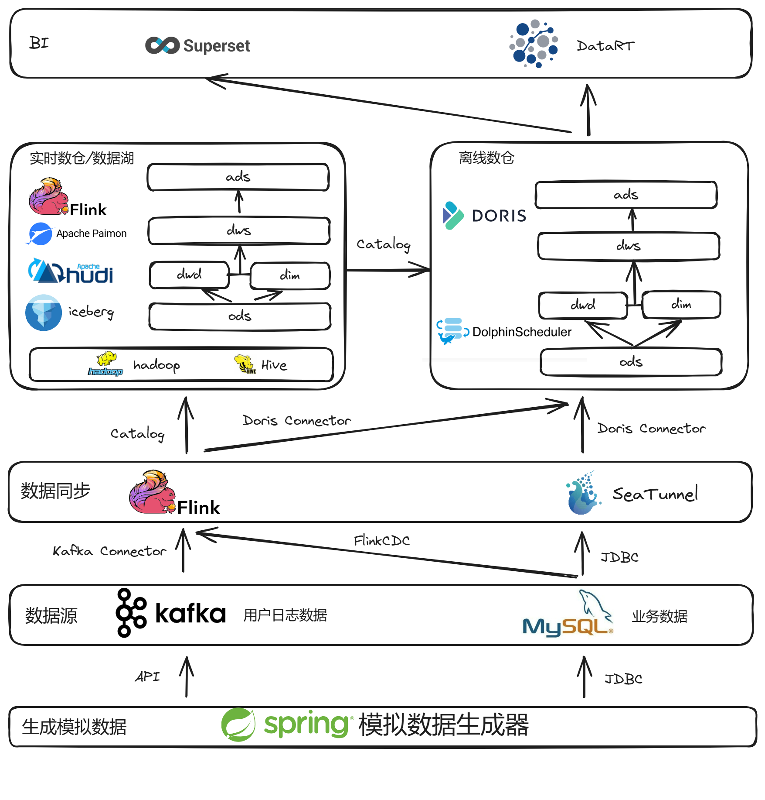

该电商数仓（实时/离线）项目技术架构分为四部分：
1. 数据源模块：采用 **JAVA** 代码来生成电商业务数据写入 **MySQL** ，生成用户日志数据写入 **Kafka** ，两者都可以在配置文件中配置需要生成数据的日期
2. 数据采集模块：使用 **Dinky** 开发 **FlinkSQL** 代码来消费 **Kafka** 用户日志数据并写入 **Doris** \ **Paimon** \ **Hudi** \ **Iceberg** ODS 层，使用 **DolphinScheduler** 配置 **SeaTunnel** 任务同步 **MySQL** 业务数据到 **Doris** ODS 层, 使用 **FlinkSQL/CDC** 方式分别采集 **Kafka** 和 **MySQL** 中的数据到 **Paimon** \ **Hudi** \ **Iceberg** ODS 层
3. 数仓模块：数仓模块采用业界通用的 **ODS** -> **DWD/DIM** -> **DWS** -> **ADS** 四级分层，数据在 **Doris** \ **Paimon** \ **Hudi** \ **Iceberg** 中分别通过批量调度和实时处理的方式进行流转
4. 数据可视化：**ADS** 层和 **DWS** 层的数据可以通过 **SuperSet** 和 **DataRT** 来进行报表和大屏制作及展示 

# 通用部分

#### 1) 组件安装

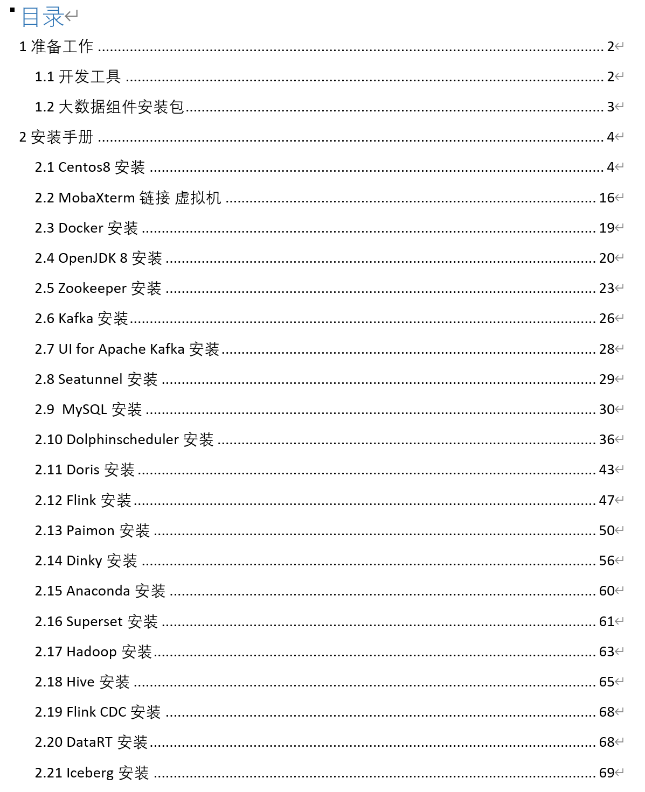

#### 2) 模拟数据生成


生成业务库数据如下图所示：


生成用户日志数据如下图所示：


# 离线数仓建设部分(Doris)

涉及组件：**Kafka** + **Flink** + **Doris** + **Seatunnel** + **Dolphinscheduler**

#### 1) 数据采集

**Kafka** 数据通过 **Flink** 接入 **Doris**


**MySQL** 数据通过 **SeaTunnel** 接入 **Doris**

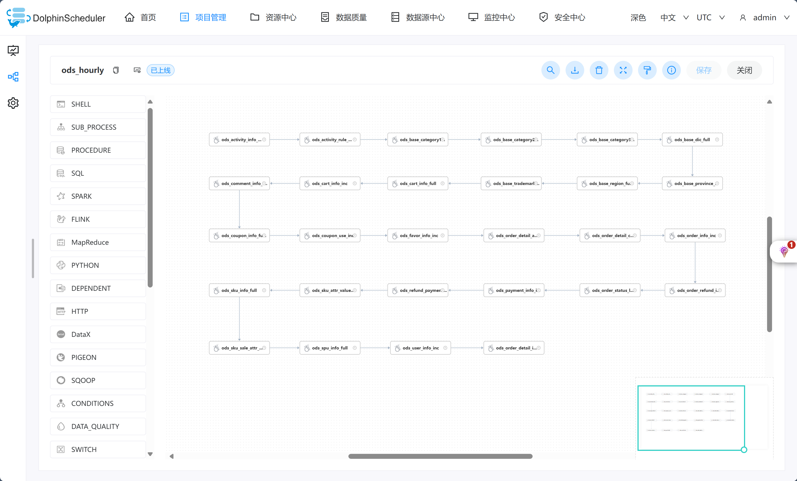

#### 2) **Doris ODS** 层建设

数据采集进 **Doris ODS** 层，实现效果如下图所示：


#### 3) **Doris DIM** 层建设

开发 **DorisSQL** 进行 **DIM** 层数据处理

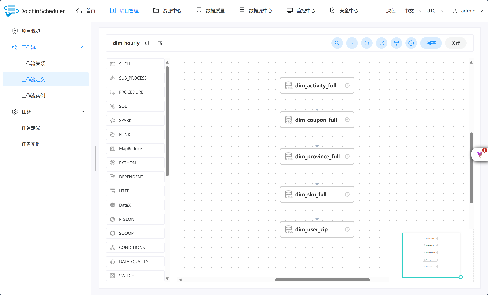

**DIM** 层数据实现效果如下图：


#### 4) **Doris DWD** 层建设

开发 **DorisSQL** 进行 **DWD** 层数据处理


**DWD** 层数据实现效果如下图：


#### 5) **Doris DWS** 层建设

开发 **DorisSQL** 进行 **DWS** 层数据处理

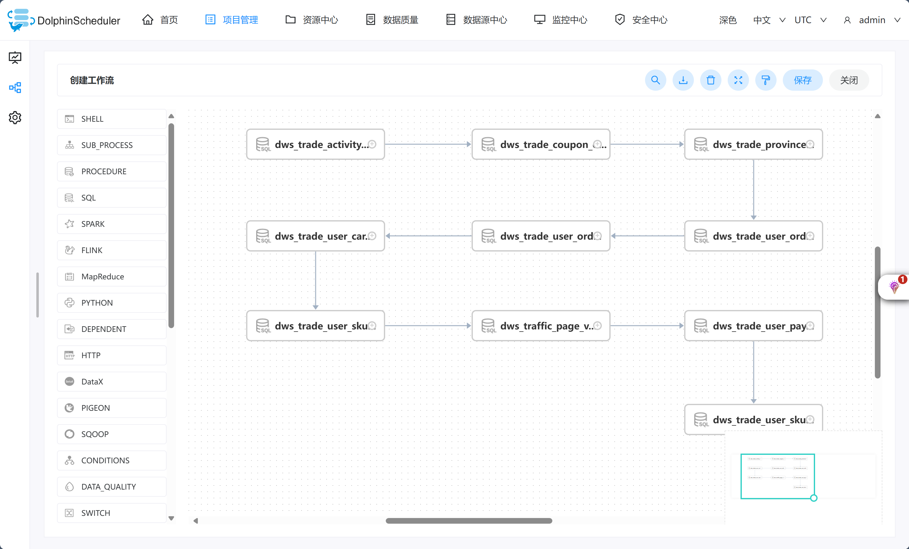

**DWS** 层数据实现效果如下图：


#### 6) **Doris ADS** 层建设

开发 **DorisSQL** 进行 **ADS** 层数据处理


**ADS** 层数据实现效果如下图：

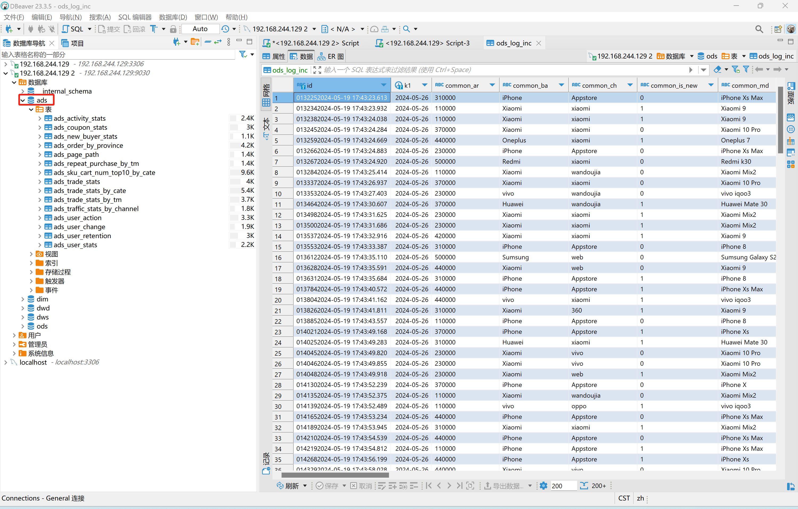

#### 7) 任务编排

最终的任务概览如下图所示

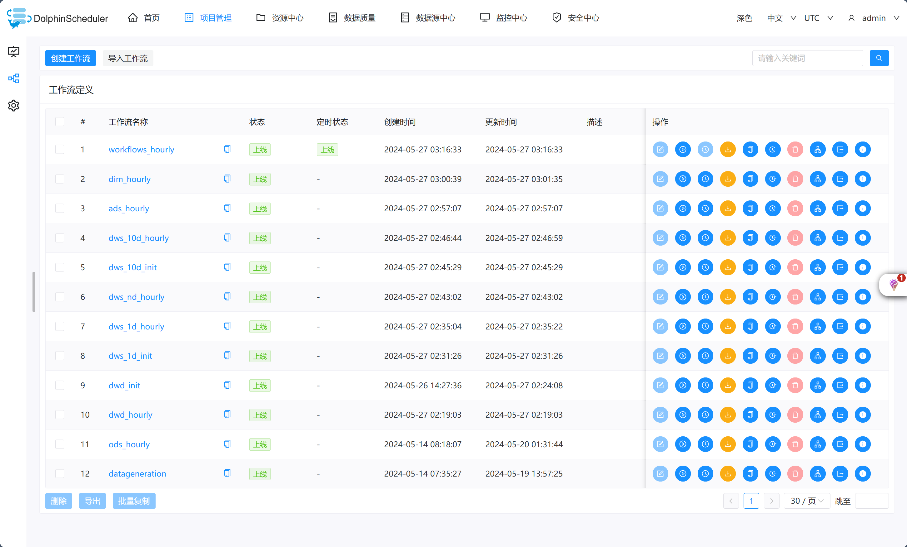

任务编排效果如下图所示


#### 8) 数据展示


# 实时数仓（数据湖）建设部分（Paimon/Hudi/Iceberg）

涉及组件：**Kafka** + **Flink(CDC/SQL/UDF)** + **Paimon/Hudi/Iceberg** + **Hive** + **Dinky**

#### 1) **Paimon ODS** 层建设

**Kafka** 数据通过 **FlinkSQL** 接入 **Paimon/Hudi/Iceberg** ,实际数据落到 **Hive**

**MySQL** 数据通过 **FlinkCDC** 接入 **Paimon/Hudi/Iceberg** ,实际数据落到 **Hive**


数据采集进 **Paimon ODS** 层，实现效果如下图所示：

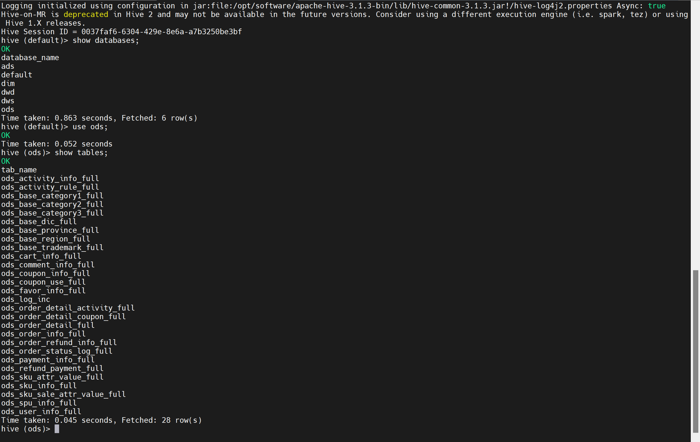

#### 2) **Paimon DWD** 层建设

开发 **FlinkSQL** 进行 **DWD** 层数据处理


**DWD** 层数据实现效果如下图：

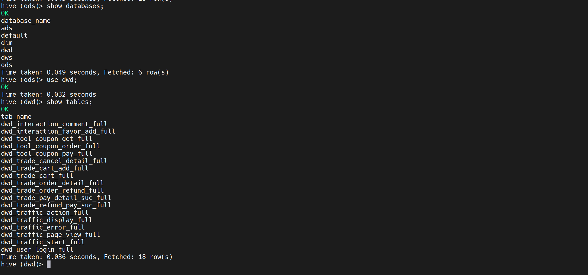

#### 3) **Paimon DIM** 层建设

开发 **FlinkSQL** 进行 **DIM** 层数据处理

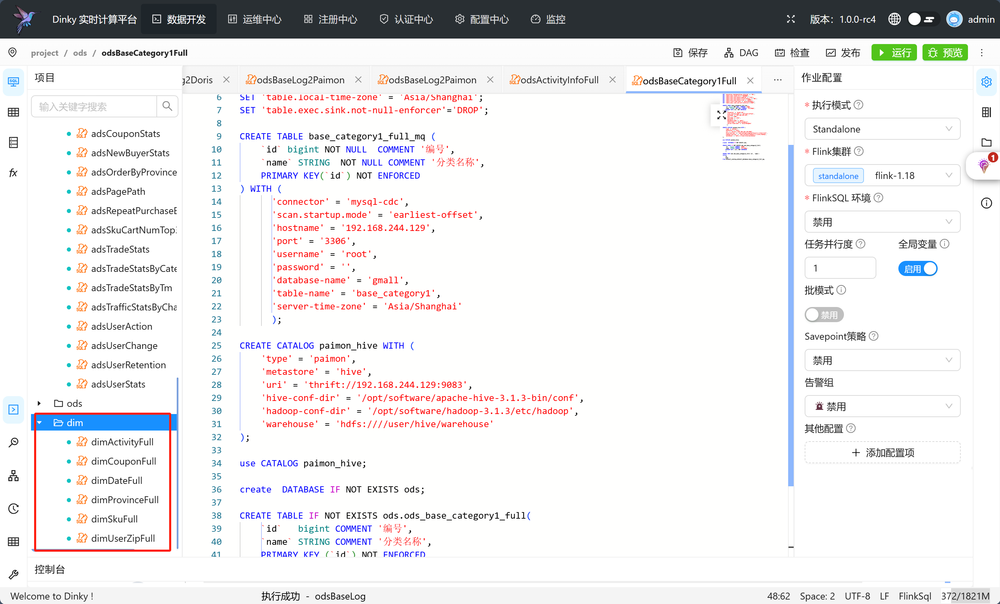

**DIM** 层数据实现效果如下图：


#### 4) **Paimon DWS** 层建设

开发 **FlinkSQL** 进行 **DWS** 层数据处理

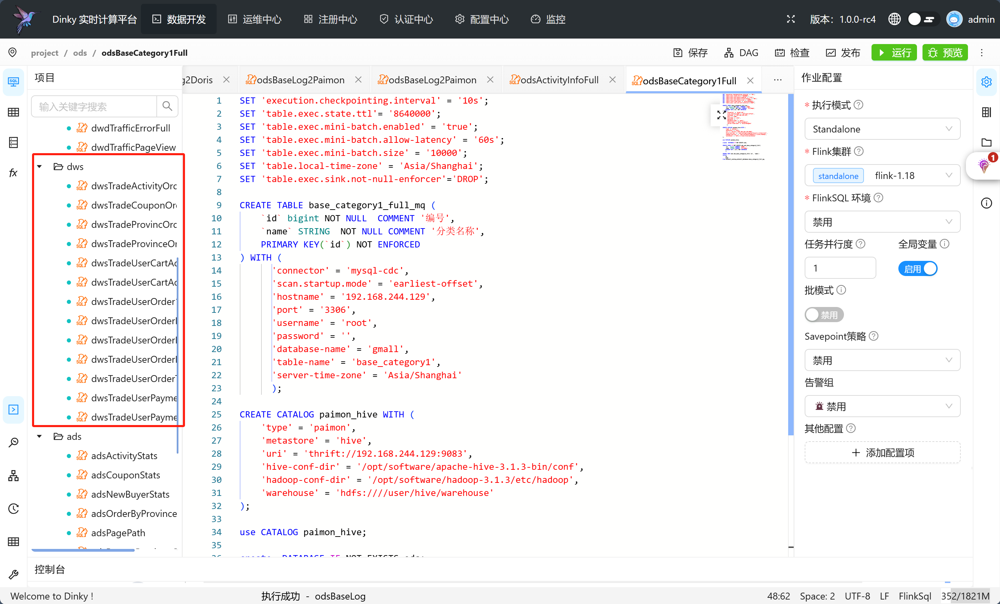

**DWS** 层数据实现效果如下图：

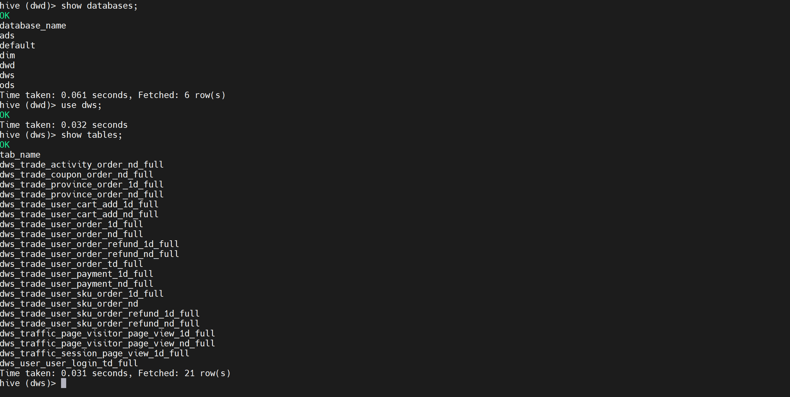

#### 5) **Paimon ADS** 层建设

开发 **FlinkSQL** 进行 **ADS** 层数据处理


**ADS** 层数据实现效果如下图：


#### 6) **Doris Catalog** 连接 **Paimon** + **DataRT** 进行数据展示

