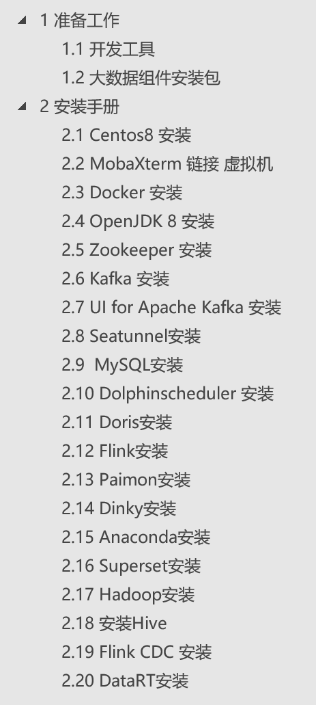

# 开源不易，请各位朋友点个 ***★star★*** 支持一下，非常感谢~

[【 Github地址：https://github.com/Mrkuhuo/data-warehouse-learning 】](https://github.com/Mrkuhuo/data-warehouse-learning)

[【 Gitee 地址：https://gitee.com/wzylzjtn/data-warehouse-learning 】](https://gitee.com/wzylzjtn/data-warehouse-learning)

#### 介绍

《实时/离线数仓实战》代码，其中 **warehouseV1** 和 **warehouseV2** 的区别是V1业务逻辑较为简单，V2业务逻辑比较齐全，V1的模拟数据生产是通过 **Python** 脚本模拟生成，V2的模拟数据是通过 **JAVA** 代码来生成。

#### 技术架构

该电商数仓（实时/离线）项目技术架构分为四部分：
1. 数据源模块：采用 **JAVA** 代码来生成电商业务数据写入 **MySQL** ，生成用户日志数据写入 **Kafka** ，两者都可以在配置文件中配置需要生成数据的日期
2. 数据采集模块：使用 **Dinky** 开发 **FlinkSQL** 代码来消费 **Kafka** 数据并写入 **Doris** \ **Paimon** ODS 层，使用 **DolphinScheduler** 配置 **SeaTunnel** 任务同步 **MySQL** 业务数据到 **Doris** \ **Paimon** ODS 层
3. 数仓模块：数仓模块采用业界通用的 **ODS** -> **DWD/DIM** -> **DWS** -> **ADS** 四级分层，数据在 **Doris** \ **Paimon** 中分别通过批量调度和实时处理的方式进行流转
4. 数据可视化：**ADS** 层和 **DWS** 层的数据可以通过 **SuperSet** 和 **DataRT** 来进行报表和大屏制作及展示 

# 通用部分

#### 第一步 组件安装

#### 第二步 模拟数据生成

生成业务库数据如下图所示：

生成用户日志数据如下图所示：

# 离线数仓建设部分

#### 涉及组件：Kafka + Flink + Doris + Seatunnel + Dolphinscheduler

#### 第一步  数据采集

**Kafka** 数据通过 **Flink** 接入 **Doris**

**MySQL** 数据通过 **SeaTunnel** 接入 **Doris**

#### 第二步  **Doris ODS** 层建设

数据采集进 **Doris ODS** 层，实现效果如下图所示：

#### 第三步  **Doris DIM** 层建设

开发 **DorisSQL** 进行 **DIM** 层数据处理

**DIM** 层数据实现效果如下图：

#### 第四步  **Doris DWD** 层建设

开发 **DorisSQL** 进行 **DWD** 层数据处理

**DWD** 层数据实现效果如下图：

#### 第五步  **Doris DWS** 层建设

开发 **DorisSQL** 进行 **DWS** 层数据处理

**DWS** 层数据实现效果如下图：

#### 第六步  **Doris ADS** 层建设

开发 **DorisSQL** 进行 **ADS** 层数据处理

**ADS** 层数据实现效果如下图：

#### 第七步  任务编排

最终的任务概览如下图所示

任务编排效果如下图所示

#### 第八步  数据展示

# 实时数仓（数据湖）建设

#### 实时数仓建设，涉及组件：Kafka + Flink(CDC/SQL/UDF) + Paimon + Hive

#### 第一步  数据采集

**Kafka** 数据通过 **FlinkCDC** 接入 **Paimon** ,实际数据落到 **Hive**

**MySQL** 数据通过 **SeaTunnel** 接入 **Doris**

#### 第二步  **Doris ODS** 层建设

数据采集进 **Doris ODS** 层，实现效果如下图所示：

#### 第三步  **Doris DIM** 层建设

开发 **DorisSQL** 进行 **DIM** 层数据处理

**DIM** 层数据实现效果如下图：

#### 第四步  **Doris DWD** 层建设

开发 **DorisSQL** 进行 **DWD** 层数据处理

**DWD** 层数据实现效果如下图：

#### 第五步  **Doris DWS** 层建设

开发 **DorisSQL** 进行 **DWS** 层数据处理

**DWS** 层数据实现效果如下图：

#### 第六步  **Doris ADS** 层建设

开发 **DorisSQL** 进行 **ADS** 层数据处理

**ADS** 层数据实现效果如下图：

#### 第七步  任务编排

最终的任务概览如下图所示

任务编排效果如下图所示

#### 第八步  数据展示

